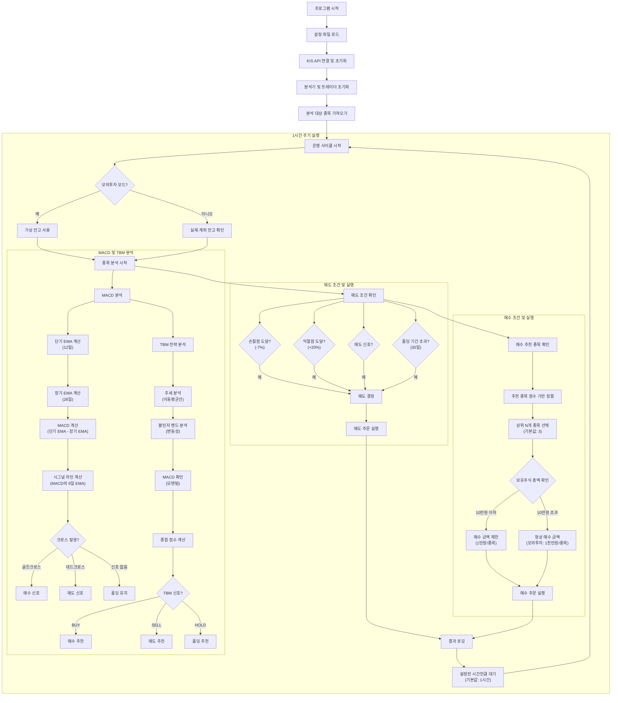

# ASTP

> 자동 주식 트레이딩 프로그램(Automated Stock Trading Program)으로, MACD와 TBM 전략을 활용한 알고리즘 기반 매매 시스템입니다.

ASTP는 한국투자증권(KIS) API를 통해 미국 주식을 자동으로 분석하고 매매하는 프로그램입니다. MACD 분석과 TBM(Trend-Bollinger-MACD) 전략을 기반으로 매수/매도 신호를 감지하고, 설정에 따라 자동으로 주문을 실행합니다. 실제 계좌와 모의투자 모드를 지원하여 안전하게 전략을 테스트할 수 있습니다.

## 사용 방법

> Pythonanywhere에서는 `cd ~/astp && python main/main.py`로 실행 가능!

### 설치

```bash
# 저장소 클론
git clone https://github.com/your-username/astp.git
cd astp

# 필요 패키지 설치
pip install -r requirements.txt
```

### 설정

1. `data/config.yaml` 파일에서 필요한 설정을 수정합니다:

```yaml
api_info:
  id: "YOUR_ID"
  account: "YOUR_ACCOUNT"
  app_key: "YOUR_APP_KEY"
  app_secret: "YOUR_APP_SECRET"
  virtual_app_key: "YOUR_VIRTUAL_APP_KEY"
  virtual_app_secret: "YOUR_VIRTUAL_APP_SECRET"
  is_virtual: true  # 모의투자 모드 활성화 여부
```

2. 자동 매매 설정:

```yaml
trading_settings:
  auto_trading_enabled: false  # 자동 매매 활성화 여부
  stop_loss_threshold: -7.0    # 손절 기준 손실률 (%)
  take_profit_threshold: 20.0  # 익절 기준 수익률 (%)
  max_holding_days: 30         # 최대 보유 기간 (일)
  max_buy_stocks: 3            # 한 번에 최대로 매수할 종목 수
  budget_percentage: 30        # 사용 가능 자금 중 한 번에 사용할 비율 (%)
  risk_level: 2                # TBM 전략의 위험 수준 (1-보수적, 2-중간, 3-공격적)
```

### 실행

```bash
python main.py
```

## 작동 방식



### 분석 프로세스

ASTP는 두 가지 주요 분석 전략을 사용합니다:

1. **MACD 분석**: 단기 및 장기 지수이동평균의 차이를 계산하여 골든크로스와 데드크로스를 식별합니다.
2. **TBM 전략**: 트렌드, 볼린저 밴드, MACD를 결합한 복합 분석 방법으로 매수/매도 신호의 정확도를 높입니다.

## 주요 기능

### 자동 매매

- 설정된 주기(기본 1시간)마다 자동으로 분석 및 매매 실행
- NASDAQ 100 기업 자동 추적 또는 수동 종목 설정 가능
- 매수/매도 조건 사용자 정의 가능

### 모의투자 모드 개선사항

- 실제 자금 투입 없이 전략 테스트 가능
- 현금 잔고 확인 생략 - 모의투자 모드에서는 KIS API 호출 없이 바로 매수 주문 실행
- 보유주식 금액에 따른 지능적 투자:
  - 보유주식 총액이 10만원 이하: 종목당 1만원으로 매수 금액 제한 (리스크 관리)
  - 보유주식 총액이 10만원 초과: 종목당 1천만원으로 매수 (기본 설정)
- 연결 오류 발생 시에도 매매 실행 가능 (예외 처리 강화)

### 매도 조건

- **손절점**: 설정된 손실률 도달 시 자동 매도
- **익절점**: 설정된 수익률 도달 시 자동 매도
- **TBM 매도 신호**: 전략 분석 결과 매도 신호 발생 시
- **홀딩 기간 초과**: 최대 보유 기간 초과 시 매도

## 설정 상세 설명

### system
- `operating_cycle`: 분석 및 매매 실행 주기 (초 단위)

### macd_settings
- `period`: 데이터 조회 기간
- `interval`: 데이터 조회 간격
- `ema_short`: 단기 지수이동평균 기간
- `ema_long`: 장기 지수이동평균 기간
- `signal_period`: 시그널 라인 계산 기간

### trading_settings
- `auto_trading_enabled`: 자동 매매 활성화 여부
- `stop_loss_threshold`: 손절 기준 손실률 (%)
- `take_profit_threshold`: 익절 기준 수익률 (%)
- `max_holding_days`: 최대 보유 기간 (일)
- `max_buy_stocks`: 한 번에 최대로 매수할 종목 수
- `budget_percentage`: 사용 가능 자금 중 한 번에 사용할 비율 (%)
- `risk_level`: TBM 전략의 위험 수준 (1-보수적, 2-중간, 3-공격적)

## 로깅

프로그램은 모든 활동을 로그로 기록합니다:
- 분석 시작 시간
- 매수/매도 시그널 감지
- 주문 실행 결과
- 오류 및 예외 상황
- 보유주식 총액에 따른 매수 금액 제한 정보

## 오류 처리 기능

- 네트워크 연결 오류 시 자동 처리
- 미국 장 개장 여부 확인 실패 시 기본값(개장 중) 사용
- 모든 주요 함수에 예외 처리 추가하여 프로그램 중단 방지
- 계좌 잔고 조회 오류 발생 시 모의투자 모드로 전환 가능

## 주의사항

- 이 프로그램은 투자 결과를 보장하지 않습니다.
- 실제 투자 전 충분한 모의투자 테스트를 권장합니다.
- KIS API 키는 안전하게 보관하고 공개하지 마세요.
- 서버에서 운영 시 충분한 보안 조치를 취하세요.

## 보안 설정 및 실행 방법

### API 키 보안 관리

ASTP는 한국투자증권 API 키를 안전하게 관리하기 위한 여러 방법을 제공합니다:

1. **환경 변수 사용**: API 키를 환경 변수로 설정하여 코드에서 직접 참조하지 않습니다.
2. **설정 파일 템플릿**: `data/config_template.yaml`을 사용하여 환경 변수 참조 방식으로 설정 파일을 관리합니다.

### 파이썬 실행 스크립트 사용

제공된 `run_astp.py` 스크립트를 사용하여 프로그램을 실행할 수 있습니다:

1. 스크립트 내의 API 키 정보 수정:
   ```python
   # run_astp.py 파일 내에서
   api_keys = {
       "KIS_ID": "실제_ID",
       "KIS_APP_KEY": "실제_앱키",
       # 나머지 키 정보
   }
   ```

2. 스크립트 실행:
   ```bash
   python run_astp.py
   ```

### PythonAnywhere에서의 보안 설정

PythonAnywhere에서 ASTP를 실행할 때 다음과 같은 방법으로 API 키를 안전하게 관리할 수 있습니다:

1. **시스템 환경 변수 설정**:
   ```bash
   # PythonAnywhere의 Bash 콘솔에서
   echo 'export KIS_ID="your_id"' >> ~/.bashrc
   echo 'export KIS_APP_KEY="your_app_key"' >> ~/.bashrc
   # 나머지 키도 동일하게 설정
   source ~/.bashrc
   ```

2. **Always-on 작업 설정**:
   - PythonAnywhere의 "Tasks" 탭에서 "Add a new scheduled task" 선택
   - 다음 명령어 입력: `cd ~/astp && python run_astp.py`
   - "Always on" 또는 원하는 일정으로 설정

이러한 방법을 통해 API 키가 코드에 직접 포함되지 않아 보안을 강화할 수 있습니다.

## 변경 이력

### 2024년 최신 업데이트
- 모의투자 모드에서 현금 잔고 확인 생략 기능 추가
- 보유주식 총액이 10만원 이하일 경우 매수 금액을 1만원으로 제한하는 리스크 관리 기능 추가
- 예외 처리 강화로 네트워크 오류 발생 시에도 계속 실행 가능
- 코드 안정성 향상 및 버그 수정